# Silence .eaf Audio Segments

**University of California, Los Angeles**\
Communications Department\
Lab of Professor Anne Warlaumont

**Mentors:**\
Anne Warlaumont\
UCLA Professor\
[Emergence of Communication Lab](https://www.annewarlaumont.org)

Kyle MacDonald\
UCLA Postdoc Researcher\
[Kyle MacDonald's Website](https://kemacdonald.com)

**Contributors:**\
Anne Warlaumont

Kyle MacDonald

Vicky Chen\
Double Major: Business Economics and Communication\
UCLA Anderson School of Management: Masters of Science in Business Analytics

Curt Chang\
Major: Commuications w/ Computing Specialization

Dania Pineda\
Major: Applied Linguistics\
Minor: Education Studies


Greetings,

Thank you for taking the time to take a look at our project!

Our most important task as Research Assistants is to ensure the privacy of particpants as we vet audio recordings.  ELAN is
a software tool that we utilize to annotate time selections of the sensitive information during the vetting process.  ELAN
creates a A file extension of type (.eaf) that containing annotations and their associated time segments.  

Opening the file (.eaf) with a text editor displays the ELAN information (annotation and time selections) in XML format.  We
utilize Python and the module [xmltodict](https://pypi.org/project/xmltodict/) to extract this information, such as annotated text, selected tiers, time slots, etc.  

After we have extracted the time segments (from the .eaf file) that contain the sensitive information of the
participants, we use the module [pydub](https://pypi.org/project/pydub/) to silence out those time segments.

P.S.

Special thank you to James Robert (http://jiaaro.com) for his guidance on using the pydub module.

## Step 1: Here is how to check if Python 3 is already available on your desktop:
1. Start off by holding the "cmd" button followed by the spacebar button. The "Spotlight Search" function should then appear. Then, inside the "Spotlight Search" bar, type in "terminal". The following image should appear, this is the terminal window these instructions will refer to.
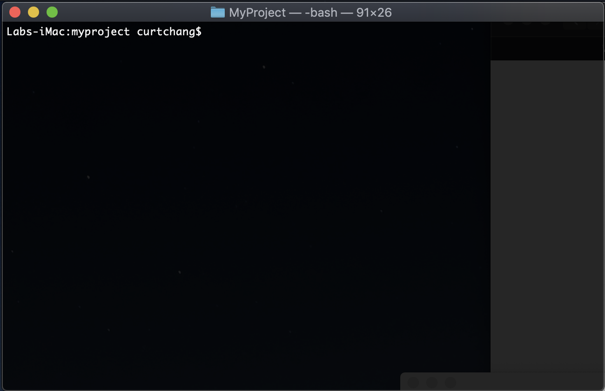
2. Type "python3" directly into the terminal window. If you have Python 3 installed, your output should resemble the following picture. (Note: I have added the green underline under "Python 3" and the green arrow pointing to ">>>" in order to emphasize the parts of the terminal that prove Python 3 is now initiated.Alson, The green underline in the picture shows "Phython 3.7.2" but your version could be higher than "3.7.2", so long as it is not "Python 2.x.x". 
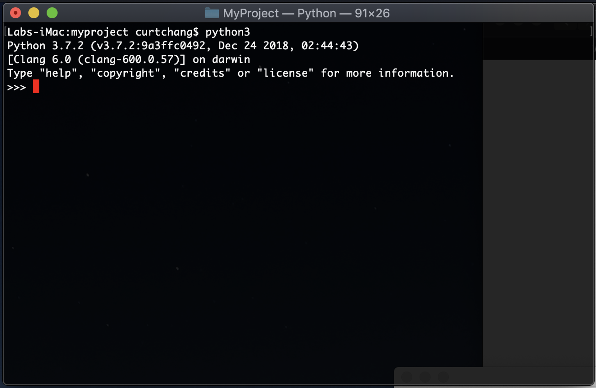
3. Do not close terminal

## If Python 3 is not on the computer, please download the latest edition of Python:
Python version 3 is available for download here: [python](https://www.python.org/downloads/)

## Step 2: Check if pip/pip3 is installed on the computer:
1. Terminal should still be open and you may still be in python (indicated by these >>>). Please exit out of python by typing "exit()" (without quotation marks) similar to the image below:

2. In terminal, type "pip --version" (without quotation marks but with a space in between "pip" and "--") The picture below shows the output you will receive if you have pip installed.
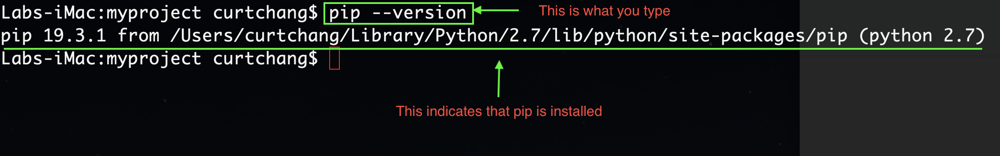

- However, if you receive a "command not found" message, this means pip/pip3 is not installed:


## If pip/pip3 is not installed, please download pip/pip3
1. Right click on this link -> [pip](https://bootstrap.pypa.io/get-pip.py) and select Download Linked File or Save Link As.
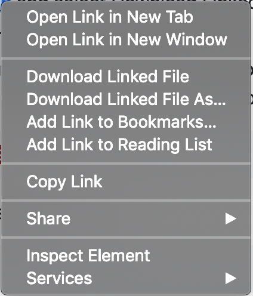
2. Click on the Finder icon in your dock, then look for the Downloads tab, and there you will find the 'get-pip.py' file.  Please move/click/drag this file to the desktop.  The pictures should help guide you:
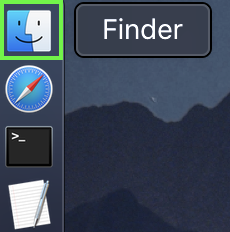
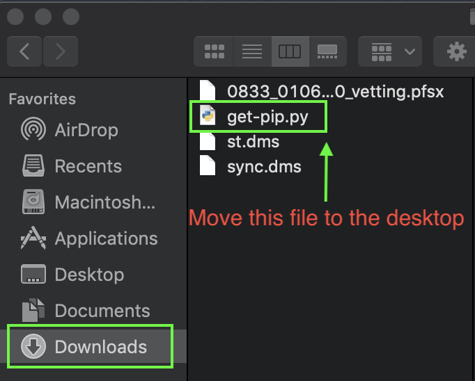
3. Go back to the terminal and type 'cd /users/AccountName/desktop' (without quotation marks, but with a space in between "cd" and "/users/...").  You will be replacing 'AccountName' with your AccountName.  You can find this in the terminal.  I have encased mine in a green box as an example.  The picture should help:
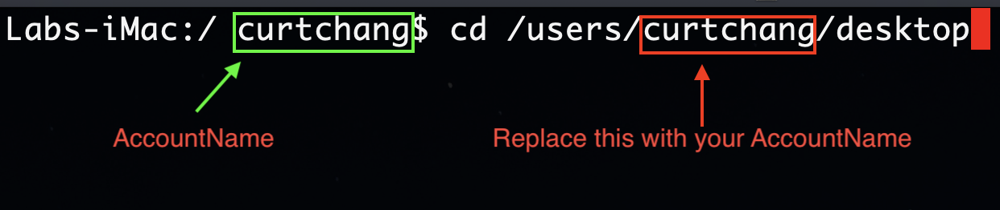
4. Now let's run the get-pip.py file that we just downloaded.  Type 'python3 get-pip.py' (without quotation marks) into the terminal, just like it is shown in the picture. Text will automatically fill the terminal so do not be alarmed. 
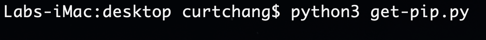
5. Now, let's check to see if you have successfully installed pip by typing "pip --version" (without quotation marks). The following image should appear:


## Step 3: Install pydub and xmltodict:
We will use pip to install xmltodict and pydub.  These modules will be used in the silencing and parsing of the audio file and .eaf file
1. In your terminal, type "pip3 install pydub --user" (without the quotations) just like the picture below:
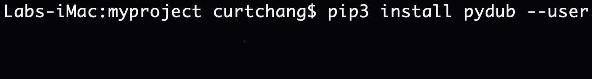
2. Next, after pydub is finishing installing, type 'pip3 install xmltodict --user' (without the quotations) just like the picture below:
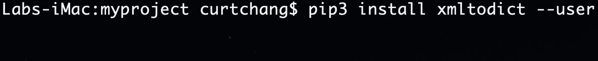

## Step 4: Set/Edit the PATH Environment
Now that the modules pydub and xmltodict have been downloaded, we need to tell Python where to look for them.
1. In terminal, type 'cd /users/AccountName' (without the quotation marks), replace AccountName with yours.
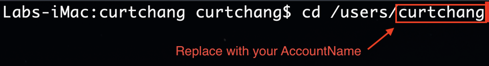
2. Next, type 'nano .bash_profile' (also without the quotation marks).
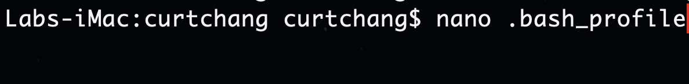

3. You will then be directed to another window that looks similar to the one in the picture below. 
- In the first line, type 'PATH="/Users/AccountName/Library/Python/3.7/lib/python/site-packages:${PATH}' (without the outer quotation marks). You may copy and paste this directly to the terminal. Keep in mind, however, that you must change the AccountName to your corresponding AccountName. 
- In the second line, type 'export PATH' (without quotation marks).
Your output should resemble the example below. Then, control+x to exit.
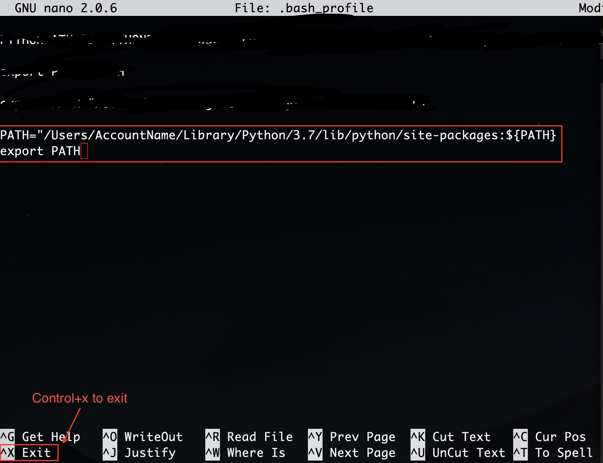

4. Then you'll be asked to save. Enter 'y' (without quotation marks).
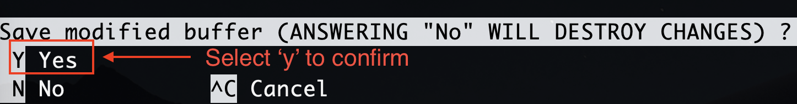
5. Then, the following options will appear. Simply press the enter/return button on your keyboard. 
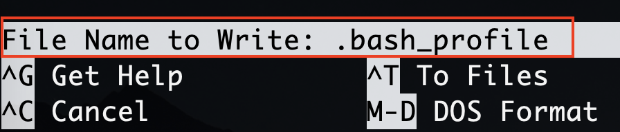
6. Exit terminal application.
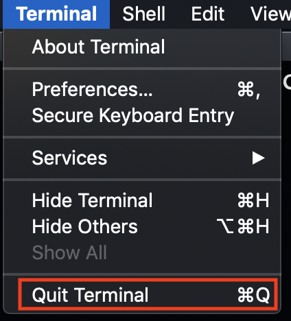
7. Lastly, open up the terminal application once again by holding the "cmd" button followed by the spacebar button. The "Spotlight Search" function should then appear. Then, inside the "Spotlight Search" bar, type in "terminal". We need to check to see if the path that we entered in works.  In the terminal window, type "python3" (without quotation marks), then type 'import xmltodict' (also without quotation marks). See picture below for reference.
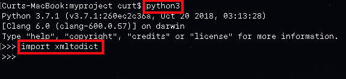
8. You will know if you received an error if the following screen appears: 

```python
Traceback (most recent call last):
  File "<stdin>", line 1, in <module>
ModuleNotFoundError: No module named 'xmltodict'
```

## Step 5: Download Zip Folder and Extract Contents
Navigate to this link: [main page](https://github.com/truc-c/Comm-Lab-Project)
1. Click on the green 'Clone or download' pull down menu.

2. Click on 'Download ZIP'.
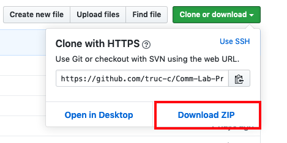
3. On the computer, go to Finder in the dock and navigate to the 'Downloads' tab.  There you will find the folder titled "Comm-Lab-Project-master". 

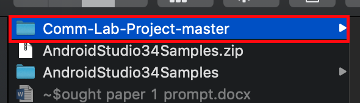
4. Move the folder onto your desktop.

5. Open the folder (Comm-Lab-Project-master) and move the 2 files (extract_and_silence.py and parsing_functions.py) to your desktop.
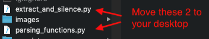

## Step 6: Running the code in MacOS terminal
1. Open "Terminal" if it is not already opened. If not, refer to Step 1, #1. 

2. Now that Terminal is open, nagivate to desktop by typing 'cd /users/AccountName/desktop' (without quotation marks) into the Terminal box. You will be replacing 'AccountName' with your AccountName.  I have encased mine in a green box as an example.  The picture should help:

3. If you have nagivated the previous steps correctly, the image below should resemble your Terminal window.
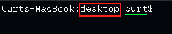
4. Before continuing with the next steps, please read through all of the instructions from 4.1-4.3. before pressing the return or enter button.

- 4.1. Copy and paste the text below into the Terminal window then push the space bar after pasting the text but DO NOT push enter (there are more steps to be followed):
```python
python3 -W ignore extract_and_silence.py
```
- 4.2. Drag the merged (aka combined) .eaf file into the Terminal first. Then, drag its corresponding audio (.wav) file into. If you drag in the wrong .eaf or .wav file, you may simply delete it manually in the Terminal with the backspace button. The end result should look similar to the image below.  The text in the red and green box may be different from my example and that is okay.  Click on the image if it is too small to read.
- 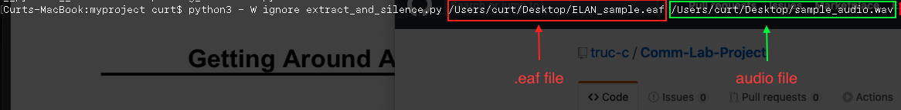

- 4.3. Notice that there is a space between "python3 -W ignore extract_and_silence.py", your .eaf file, and the .wav file. The space between the three components is important in performing the action so if you are missing a space, simply use your arrow keys on the keyboard to manually add a space using the spacebar. Now that all of the formatting is complete, you may FINALLY push the Enter/Return key to perform the completed action. Below is a picture for reference:
- 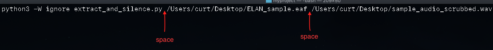

## Step 7: Follow the Instructions in Terminal

If everything in Step 6 has been done correctly, you will be presented with text similar to the one in the image below in the red box, but a bit different. If it starts with 'List of all tiers:' then you are on the right track. Your Terminal should list all of the tiers that were previously created in your .eaf file. However, if it is different, you may need to redo step 6. Click on the image if it is too small to read.
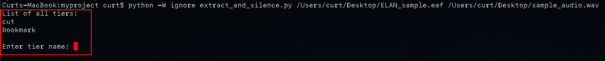

1. Type in a tier name (e.g. Dania_cut) into the Terminal and press Enter/Return. Feel free to choose any tier of your interest, it does not matter which tier you choose because we are not silencing it at this point. You will instructed which tier to specifically silence later in the steps. This is simply for you to explore. The Terminal should display all annotations of that tier. Below is a picture for reference:
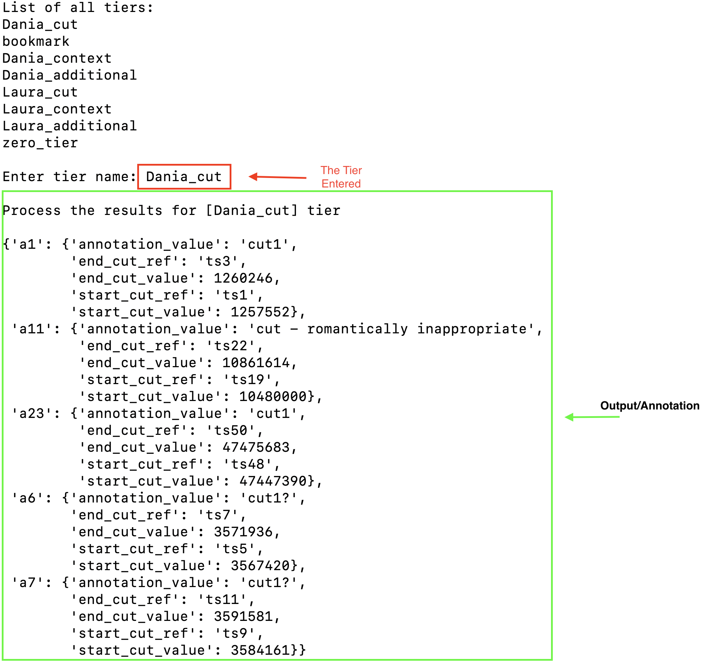

2. Once in Terminal, scroll all the way to the bottom after the annotations. You will be presented with the following question and options to choose from. 
- press 'y' to select another tier and see those annotations
- press 'n' to continue on to the audio silencing process
- press "0" to exit out of the Python program


3. Type in the letter "n" (without quotation marks) and push Enter/Return. A new question will then appear (as shown in the red box). Then, type in the letter "y" (without quotation marks) to new question. Your screen should resemble the picture below.
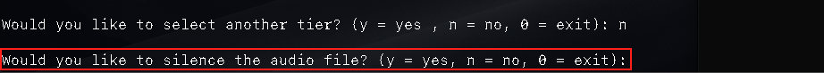

4. Notice, Terminal is now asking you which tier you would to silence. Type in 'zero_tier', unless explicitly instructed to silence a different tier. 
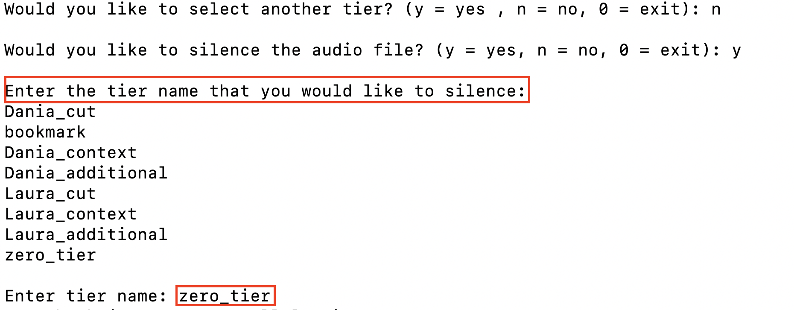

5. When python is finished with the silencing process, it will create a new .wav file labeled '...scrubbed.wav'.
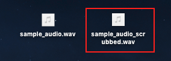

6. Upload the scrubbed.wav file into HomeBank BOX.


## Modules:
- [xmltodict](https://pypi.org/project/xmltodict/)
- [pydub](https://pypi.org/project/pydub/)
- os
- sys
- platform
- pprint

Modules os, sys, platform and pprint are built-in modules.  


## Sample audio, Sample .eaf file, and Sample code:
- [sample audio](https://github.com/truc-c/Comm-Lab-Project/tree/master/raw%20data)
- [sample .eaf](https://github.com/truc-c/Comm-Lab-Project/tree/master/raw%20data)
- [extract_and_silence](https://github.com/truc-c/Comm-Lab-Project/blob/master/extract_and_silence.py)

The sample_audio.wav is a 30 second audio of Curt Chang counting from 1 to 30.\
The ELAN_sample.eaf are annotations that Curt Chang has made using ELAN.\
The software is available for download here: [ELAN](https://tla.mpi.nl/tools/tla-tools/elan/)

## Documentation:
Here are some examples of how to use the functions and their output.

### imports:
```python
import parsing_functions as pf
import xmltodict
import pprint
import sys
import platform
```

- myproject is a folder where we stored our parsing_functions.py
- `xmltodict` module is used to create a xml object from our .eaf file
- `pprint` module helps with the format of the output
- `sys` module is used to provide an additional argument (path to eaf file) when running our python code in terminal
- `platform` is used to check our python version

### code example of functions and their output:
get_tier_names(eaf_obj) 
- returns a list of all the TIER_ID's in the .eaf file\
(e.g.,[ELAN_sample.eaf](https://github.com/truc-c/Comm-Lab-Project/blob/master/raw%20data/ELAN_sample.eaf) contains 2 TIER_ID's, cut and bookmark)
```python
with open(eaf_file) as file_obj:
    eaf_obj = xmltodict.parse(file_obj.read())
tier_name_list = pf.get_tier_names(eaf_obj)

print(tier_name_list)             # output: [cut,bookmark]
```

py_version_input(python_version,tier_name_prompt) 
- selects the input format depending on the python version and returns a string
```python
python_version = int(platform.python_version()[0])
tier_name_prompt = 'Enter tier name: '
user_input = pf.py_version_input(python_version,tier_name_prompt)
```

extract_timeid_and_value(eaf_obj)
- retrieves the values for TIME_SLOT_ID and TIME_VALUE in the TIME_ORDER tag from the .eaf file and returns a dict
```python
with open(eaf_file) as file_obj:
    eaf_obj = xmltodict.parse(file_obj.read())
time_ids_and_values = pf.extract_timeid_and_value(eaf_obj)

print(time_ids_and_values)        # output: {'ts1': 4670, 'ts2': 7310, ...,'ts11': 25605, 'ts12': 28445}
```

extract_annotations(eaf_obj,user_input)
- creates a nested dict that contains the ANNOTATION_ID, TIME_SLOT_REF1, TIME_SLOT_REF2, and ANNOTATION_VALUE
- this function requires 2 arguments, the eaf object and user input of the requested tier name returned from the py_version_input() function
- in addition, we use pprint() to better format the output
- NOTICE: the keys start_cut_value and end_cut_value are empty (0).  These values will be filled with the next function fill_time_values() 
```python
with open(eaf_file) as file_obj:
    eaf_obj = xmltodict.parse(file_obj.read())
user_input = pf.py_version_input(python_version,tier_name_prompt)

annotation_values = pf.extract_annotations(eaf_obj,user_input)

pprint.pprint(annotation_values)

# output: {'a1': {'annotation_value': 'cc: five six seven',
#        'end_cut_ref': 'ts2',
#        'end_cut_value': 0,
#        'start_cut_ref': 'ts1',
#        'start_cut_value': 0},
#        ...
```

fill_time_values(time_ids_and_values,annotation_values)
- ! IMPORTANT ! before using, this function REQUIRES the dict returned from the function extract_timeid_and_value(eaf_obj)
- this function does not return anything, but only fills the values inside our annotation_values object from the extract_annotations(eaf_obj,user_input) function
```python
with open(eaf_file) as file_obj:
    eaf_obj = xmltodict.parse(file_obj.read())
time_ids_and_values = pf.extract_timeid_and_value(eaf_obj)
annotation_values = pf.extract_annotations(eaf_obj,user_input)

pf.fill_time_values(time_ids_and_values,annotation_values)

# output: {'a1': {'annotation_value': 'cc: five six seven',
#        'end_cut_ref': 'ts2',
#        'end_cut_value': 7310,
#        'start_cut_ref': 'ts1',
#        'start_cut_value': 4670},
#        ...
```

silence_segments(annotation_values,audio_object)
- ! IMPORTANT ! before using, this function REQUIRES the annotation dict returned from the extract_annotations() function
- ! IMPORTANT ! before using, the function fill_time_values() must be called on the returned dict from extract_annotations()
please see code above
- this function takes 2 arguments, first argument is the returned dict and the second argument is audio wave object created from AudioSegment
- this function returns the an audio object with the time segments, provided by start_cut_value and end_cut_value, silenced
- (Optional play function)
- the module simpleaudio is need to use the play() function
```python
pip install simpleaudio
```
- pydub has a play() function to listen to the silenced audio
```python
from pydub.playback import play
... #skipped some code
annotation_values = pf.extract_annotations(eaf_obj,user_input)
pf.fill_time_values(time_ids_and_values,annotation_values)

audio_object = AudioSegment.from_wav(selected_audio_file.strip())
silenced_audio_object = pf.silence_segments(annotation_values,audio_object)
play(silenced_audio_object)
```
